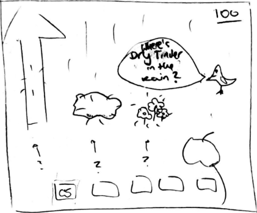
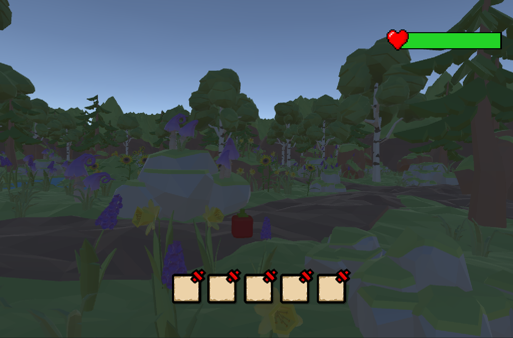

# Game Design Document (GDD)

## Game Overview

### Core Concept

Night in the Woods is a captivating survival and educational experience set in a lush forest environment. The game revolves around a human protagonist who finds themselves stranded in the middle of the night in a dense forest, with the goal of surviving until sunrise when a rescue team is expected to rescue them. The player, accompanied by a companion, must navigate through various survival challenges posed by the wilderness and learn essential survival techniques and skills to ensure their safety until help arrives. Their role is to make critical decisions to find food, build shelter, protect themselves from animals and weather conditions, and navigate through the woods to find the meeting point with the rescue helicopter.

 Image from https://images.unsplash.com/photo-1512747646639-ed824d861e0d?ixlib=rb-4.0.3&ixid=M3wxMjA3fDB8MHxzZWFyY2h8Mnx8Zm9yZXN0JTIwbmlnaHR8ZW58MHx8MHx8fDA%3D&w=1000&q=80 

### Genre

The game fits into the survival, adventure and education genres. Players are challenged to survive in a natural environment while at the same time learning practical skills and techniques that are essential for wilderness survival. These genres emphasise the immersive experience of navigating a challenging wilderness setting and the educational value of acquiring knowledge that can be applied in real-world situations. Similar games in this category are Rust or Minecraft. Rust is a multiplayer survival game that involves challenging gameplay, open-world environment, and emphasis on player interaction and competition. In Minecraft survival mode, the player must gather resources, craft tools, build structures, and fend off threats.

  
  

   Left image from https://cdn.akamai.steamstatic.com/steam/apps/252490/ss_e825b087b95e51c3534383cfd75ad6e8038147c3.1920x1080.jpg?t=1678981332 & Right image from https://staticg.sportskeeda.com/editor/2022/11/6ca1e-16678042889550-1920.jpg 

### Target Audience

The target audience of the game involves those drawn to the survival, adventure and educational aspects of the game. These could be outdoor enthusiasts wanting to enhance their knowledge of survival skills, those who enjoy learning new skills through playing games or even educational institutions wanting to provide an engaging way to teach essential outdoor knowledge. These could also be people who have an appreciation for nature and the wilderness or those who enjoy adventurous games and narratives.

 Image from https://wildernessawareness.org/wp-content/uploads/2022/10/WSB1-1024x576.jpg 

### Unique Selling Points

The game uniquely combines survival mechanics with educational elements, teaching players real-world survival skills in an engaging and interactive manner. The game involves gamified learning, incorporating survival skills seamlessly into gameplay. The game also offer a unique way of delivering information through an animal companion. The incorporation of random external events ensures that each playthrough is distinct, creating a sense of unpredictability and replayability. 

  
  

   Left image from https://www.outdoorlife.com/uploads/2020/05/26/K43VZSE6FRFA7H7PG356R5CAVI.JPG?auto=webp & Right image from https://h9t4t3i4.stackpathcdn.com/sites/default/files/inline-images/Camo-tarp-shelter_1.jpg 

# Story & Narrative
## Story
An adventurous man embarked on a solo hike through South America's Amazon jungle. After days of exploring, a monkey steals his map, leaving him stranded and lost in the wilderness. Tasked with surviving the night, he must await rescue until he is noticed missing and a specialised team mobilises to secure his safety.

## Characters:

 Bird image from https://assetstore.unity.com/packages/3d/characters/animals/quirky-series-free-animals-pack-178235, Human image from https://assetstore.unity.com/packages/3d/characters/humanoids/fantasy/free-low-poly-human-rpg-character-219979 & Bear image from https://assetstore.unity.com/packages/3d/characters/animals/free-stylized-bear-rpg-forest-animal-228910 

  
     

### Main Protagonist 
* Human: Hiker
               
### Animal companion
* Small sparrow who follows the hiker protagonist

### Enemies
| Description  | Photo |
| ------------- | ------------- |
| Bear - in order to defeat him you will have to stand still or he will atack you.   |   |
| Monkey - in order to defeat him you will have to feed him with any berry or he will atack you. |   |
| Snake - in order to defeat him you will have to hit him with a stick or he will atack you. | |
| Lizard - in order to defeat him you will have to hit him with a stick or he will atack you. |   |
| Deer - has a baby deer that follows her. In order to defeat her you will have to stand still or she wil atack you.| |

### Character background
A traveller who is extensively exploring South America but with no previous experience in wilderness survival. Struggling with his lack of survival knowledge, he is confronted with the harsh reality of being lost.

The hiker's motivation is to ensure survival by learning how to independently manage life in the woods. He forms a friendship with a little bird, while all other characters (animals) in the game serve as enemies trying to protect their home. The character's goals involve utilising natural resources to remain alive until someone realises they're lost and send help. They must conquer nature's challenges, including finding food, seeking shelter from both the elements and animal adversaries and navigating in the woods.

### Character personality

Eager for adventures and a genuine love for learning, he thrives on new experiences; however, despite his enthusiasm, his lack of survival experience makes his task difficult but prompts a journey of growth and adaptation.

   

   Image from https://assetstore.unity.com/packages/3d/environments/landscapes/free-low-poly-nature-forest-205742 

### Setting

The forest is full with trees, bushes, rivers, rocks and a diverse array of animals. As the game progresses, the player receives updates on the rescue team's progress, offering updated on whether they've become aware of the player's absence, their understanding of the location, and their presence within the jungle in a meeting point he should reach.

## Gameplay & Mechanics

### Player Perspective
  

In our game, players experience the environment from a first-person perspective. The camera remains fixed most of the time, providing a sense of immersion.

The player's character is not directly visible on the screen.

 image from https://a.silvergames.com/screenshots/forest-survival-simulator/the-forest.jpg 

### Controls: Item Collection / Build / Attack / Defence 

We've designed the controls to be intuitive, utilising standards across most games. Standard movement is achieved using the WASD keys, while interaction with objects is done with the 'E' key. The inventory and survival skills menu can be accessed via the 1-5 keys and the mouse scroller, and the items in the inventory can be dropped with 'Q' key, read the map with the 'M' key, and jump with the 'Spacebar'. These controls provide players with a comprehensive way to navigate and engage with the game's world.

<table align="center">
   <tr>
      <th>Action</th>
      <th>Key(s)</th>
      <th rowspan="9">
        
      </th>
   </tr>
   <tr>
      <td>Movement</td>
      <td>WASD</td>
   </tr>
   <tr>
      <td>Jump</td>
      <td>SPACE</td>
   </tr>
   <tr>
      <td>Interact/Use/Attack </td>
      <td>E</td>
   </tr>
   <tr>
      <td>Access Inventory Items</td>
      <td> 1-5 or Mouse Scroll </td>
   </tr>
  <tr>
      <td>Read Map</td>
      <td>M</td>
   </tr>
   <tr>
      <td>Drop Item</td>
      <td>Q</td>
  </tr> 
  <tr>
      <td>Craft Shelter</td>
      <td>C</td>
  </tr> 
  <tr>
      <td>Pause</td>
      <td>P</td>
  </tr> 
</table>

### Progression

The game's progression is a balance between survival and learning with constant updates from the rescue team allowing the player to track their progress. Players must not only survive the night but also aim to improve their survival skills and knowledge. Central to this is the health bar, which players must continuously monitor as it diminishes over time due to environmental factors, hunger, injuries, enemies, and other challenges; however, players can regenerate it with consumables, such as food. This adds an element of resource management to the game, which becomes increasingly challenging due to external events and animal attacks, ramping up the pressure on the player.

  

   image from https://i.pinimg.com/originals/5d/5a/1a/5d5a1aab51b2b5985d0b578b83e53e1f.png 

### Educational Questions

Furthermore, the game will periodically present players with survival-related questions. These questions range from identifying edible plants to making decisions about creating shelter and treating injuries.

  

### Challenges

The game also encourages progression through constant random challenges. Animal attacks can harm the player's health, forcing them to use their skills to defend themselves or find ways to avoid these encounters. Moreover, random external events, like sudden weather changes, add unpredictability to the gameplay. The constantly diminishing health also adds further urgency, creating tension and a sense of accomplishment when the player survives the night.
Throughout the game the player must face his ememies as every meeting with an enemy reveals another part of his map until he is able to see the location of the meeting point he must reach before the time ends.

  
  
  
  
   Left image from https://i.ytimg.com/vi/3uLjSx6kvCs/maxresdefault.jpg & Right image from https://i.ytimg.com/vi/QSYkwdlDN8s/maxresdefault.jpg 

### Gameplay Mechanics

The core gameplay mechanics encompass resource management, crafting, exploration, survival skills, combat, and an educational aspect. These mechanics are interconnected where, for example, resource gathering leads to crafting, survival skills improve overall capabilities, and combat and shelter-building contribute to defence and protection. 

  
  
  
   Left image from https://www.pcgamesn.com/wp-content/sites/pcgamesn/2022/01/best-crafting-games-minecraft.jpg & Right image from https://techraptor.net/sites/default/files/styles/image_header/public/2023-02/Sons%20of%20the%20Forest%20Building%20Guide.jpg?itok=zYplOx_1 

However, The "time survival" mechanic serves as the overarching framework. Players must make efficient decisions against the clock, prioritising tasks to balance survival, learning, and exploration. This time pressure adds challenge and satisfaction, making surviving the full five minutes a significant achievement.

  

## Levels & World Design

### Game world

  
  
   Image from https://media.sketchfab.com/models/ab94e72440604d889187e1f723168eca/thumbnails/c0e5c1e5d7334daf9c9aa56b03ca3103/1024x576.jpeg 

The virtual world system in the game primarily comprises three key categories: items, structures, and enemies. Items denote entities that can be carried within the character's inventory. Conversely, structures encompass various features within the game world, each serving distinct functions, and are created with items. For example, players have the capacity to craft a shelter by using items such as 'sticks' and 'rocks'. These structures can then be placed for the player's use.

On the other hand, enemies are entities equipped with a health bar and attack damage, capable of engaging the player. Varied enemies have distinct speeds and occupy specific positions in the world.

The presentation of the game consist of four parts:
* The character’s body from a first person perspective
* The inventory hot bar at the bottom of the screen
* The pop up window of the companion Q&A Section and rescue team updates 
* The health indicator at the top of the screen 

The environment, as previously mentioned, is a low-poly cartoon forest, that is further detailed in the Arts section. 

  
  

   Images from https://assetstore.unity.com/packages/3d/environments/low-poly-woods-lifestyle-65306 

### Objects

The crafting system follows the general rule of the forest in nature, such as creating shelter from items like wood and rocks. Most of the objects are used in ways to facilitate player’s survival, such as food and a simple crafting system. Letting the player utilise the objects correctly is also a critical part of the game which educates players on their knowledge of survival practices in the wilderness. The objects can also be used to attack the enemies.

Furthermore, there are also objects that can be used as consumable to help the player replenish health. While food is the main consumable there are also poisonous fruits that will cause the player to lose health.

  

   Image from https://assetstore.unity.com/packages/3d/props/food/fruit-blocks-128327 

### Physics

The fundamental physics are integrated into the game, resulting in the player losing health due to actions such as jumping or being attacked.

The character's vertical movement adheres to a standard physics principle: when the player jumps, they ascend a particular height.

Moreover, animals possess distinctive attack patterns and speeds, with their attributes crafted based on both general knowledge and the inherent traits of each creature. Attacks also benefit from one-way collisions in which the player will only take damage if directly hit by an animal and not if they are the one initiating the attack.

## Arts & Audio

### Art Style

  
  
  
   Images from https://assetstore.unity.com/packages/3d/environments/landscapes/free-low-poly-nature-forest-205742 

We've opted for a low-poly art style to foster a visually accessible environment that prioritizes gameplay clarity and ease of recognition, allowing players to focus on crucial survival mechanics. By embracing a stylised approach, we aim to create an approachable atmosphere that enhances engagement and encourages players to explore and learn in a more relatable and memorable manner.
        
Furthermore, the object icons are made using a simplified design of basic colours such as white and dark. This design is set to not distract the player from the main survival gameplay. The cartoonish style is also made to appeal to younger audiences.

The world will also have two modes of display which are day and night. In daytime the screen display is brighter and during night the screen is displayed in a more darker and gloomy vibe. The different timespan of a day gives the player a better experience of their progressions in their survival process.

  
  
  
   Left image from https://i.cbc.ca/1.4295794.1505770043!/fileImage/httpImage/image.jpg_gen/derivatives/4x3_1180/the-long-dark-stone-s-throw.jpg & Right image from https://i.cbc.ca/1.4295792.1505770015!/fileImage/httpImage/image.jpg_gen/derivatives/original_1180/the-long-dark-bear.jpg 

### Sound and Music

The game's auditory landscape is designed to simulate the immersive experience of hiking in the forest. Therefore the whole game is enveloped in a forest-themed soundtrack. This soundtrack serves as a crucial element in enhancing the authenticity of the player's experience, infusing their gameplay with sounds that resonate with the actual atmosphere of a forest.

Sound Track Links: 
* https://pixabay.com/music/ambient-relax-in-the-forest-background-music-for-video-9145/

The complementing sound effects include special sound for task completion and eerie music when danger is approaching.

Sound Effect Links:
* https://pixabay.com/sound-effects/success-fanfare-trumpets-6185/
* https://pixabay.com/sound-effects/wolf-howling-140235/

The event completion soundtrack gives the player the excitement of correctly completing a task, immersing them in the task and the game's context.

Further, the eerie music not only carries a haunting ambiance to heighten excitement, but also alerts players that an enemy is approaching.

### Assets

The assets of the game includes the environmental and operable elements such as: 

Trees, rocks, grass, bushes, (all) animals, water (lake/river), day/night sky, (all) items, rain, map, the companion and human protagonist. This also includes any 2d sprites used for item icons in the inventory hotbar and UI.

  
  
  
   Left image from https://assetstore.unity.com/packages/3d/characters/animals/quirky-series-free-animals-pack-178235 & Right image from https://assetstore.unity.com/packages/3d/characters/humanoids/fantasy/free-low-poly-human-rpg-character-219979 

## User Interface (UI)

The aesthetic design of the game is similar to Rust or Minecraft with a minimal UI and natural, earthy colour palette that will let the player be immersed the forest setting and seamlessly blend with the overall visual style of the game. The UI elements will feel non-intrusive, environmental and atmospheric. The home screen of the game will be simple and blend with the aesthetics of the actual game with minimalistic buttons and wilderness background.

The control screen will have a similar basic UI. The health bar is positioned at the top of the screen displaying the current health status of the player, possibly displayed with increments. The score will be displayed on the top left of the screen in a simple font. Inventory will be displayed at the bottom of the screen to represent the acquired resources of the player. Update screens will also be integrated seamlessly into the game with large text.

  
  
  
  
  
  

## Technology & Tools

### VS Code (Version: 1.81) 

**Justification:** 
* Provides a powerful IDE for coding C# scripts in Unity
* Versatile option with excellent code editing capabilities.

### Adobe Photoshop  (Version: 23.5.5) 

**Justification:**
* Industry-standard image editing tool that's great for creating and optimising textures, UI elements, and other visual assets.

### Audacity (Version: 3.3.3) 

**Justification:**
* Free, open-source audio editing software
* Suitable for editing and optimising in-game sound effects, voiceovers, and background music.

### Blender (Version: 3.6.2 LTS) 

**Justification:**
* Open-source 3D modelling and animation software
* Good for creating and modifying 3D assets, characters, and environmental elements.

## Team Communication, Timelines and Task Assignment

### Communication
For team communication, we'll be using Facebook Messenger. It's a great way to ensure collaboration, especially outside of our weekly meetings which we schedule for Mondays right after class, giving us a chance to start the week with a clear plan. We've also kept Thursdays open for additional meetings if we feel they're necessary to touch base.

### Task Assignment
  
To manage our tasks and timelines, we've opted to use Trello. We find it effective for assigning tasks and keeping track of our project's progress. We're following a basic agile methodology with Trello, which means we'll be doing sprint planning to organise our work into manageable chunks so that it is fair for each group member. While we won't be focusing on retrospectives, Trello's setup allows us to stay focused on coordinating our workload efficiently. We will also make sure we consider each group member's additional work load from other subjects when assigning tasks to ensure they are not being overloaded with work.

  
  

   Left image from https://messengernews.fb.com/wp-content/uploads/2021/09/Group-Typing-Indicator-iOS-1.png & Right image from https://images.ctfassets.net/rz1oowkt5gyp/1cu7oWtxIeVq0CWLAZOcke/5cb5af00f3aa1a8f35f412c48e09f2d9/ch2_01.png 

### Prospective Timeline:

|    **GDD Completion (27/08)**    | **Unity Prototype (3/09)** | **Sprint One (17/09)** | **Sprint Two (01/10)** | **Sprint Three (15/10)** | **Final Deadline (30/10)** |
|-------|-------|-------|-------|-------|-------|
| Complete all GDD sections | Create UI & Start Screen | Finalise all enemies and animations | Create crafting system | Add sound effects | Testing |
|       | Create animal companion with questions | Add random weather events | Implement point system | Implement extra animations: e.g. third person view | Bug/Defect fixes |
|       | Create enemy and animations |       |       |       | Final quality check |
|       | Develop player controller |       |       |       |       |

# Possible Challenges
### Challenge #1
**Project scope may be too large**

*Solution: We’ll build the game in a way that will allow us to drop features that we don’t have time to invest in. For example, for the enemies we will start with a few and only add more if time will allow us*

### Challenge #2
**Maintaining focus on the educational aspect as well as survival.**

*Solution: We’ll always keep in mind that one of our main goals is to make it an educational game and we’ll always look at ways to input the educational aspect into the game.*

### Challenge #3 
**Time management - 3 of the 4 students take IT Project this semester.**

*Solution: We will create an effective plan of time so there are clear goals to meet with enough time to each goal. That way each student will have enough time to manage their time correctly and finish with their assignments.*

### Challenge #4
**No experience with Unity so doing simple tasks may take longer**

*Solution: All of the group members will attend tutorials and pay attention in class to learn key skills to help develop the game.*

### Challenge #5
**Creating animations or models if there is no available online asset** 

*Solution: Changing the enemies according to available assets or engaging in easy to learn tutorials.*
