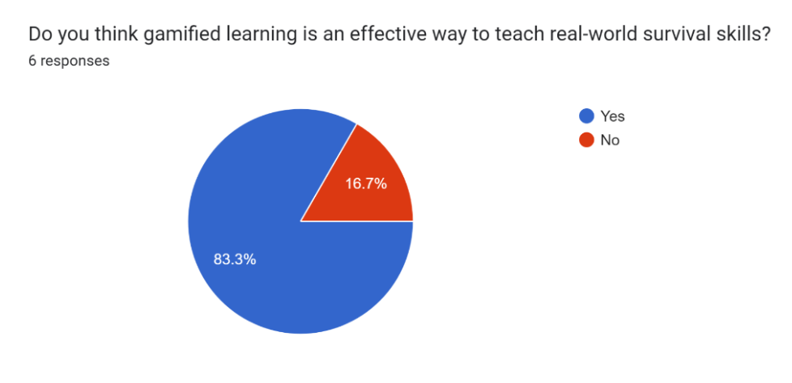

# Project 2 Report

## Table of Contents

* [Evaluation Plan](#evaluation-plan)
* [Evaluation Report](#evaluation-report)
* [Shaders and Special Effects](#shaders-and-special-effects)
* [Summary of Contributions](#summary-of-contributions)
* [References and External Resources](#references-and-external-resources)

## Evaluation Plan

### Evaluation Techniques

**1. Questionnaire:**
   - *Why:* The questionnaire is a powerful tool for gathering quantitative data quickly and efficiently.
   - *Benefits:*
     - Provides a structured way to collect user feedback.
     - Allows you to obtain direct feedback on various game features.
     - Enables you to measure user satisfaction and preferences.
   - *Tasks:* Participants will be asked to fill out a questionnaire that assesses their overall experience, satisfaction, and specific feedback on game features.
     - Questionnaire Link: https://docs.google.com/forms/u/1/d/e/1FAIpQLSe3Yxy0fIxNo-uLitACOqKc1xJjpAFPvUdw9duivfnhWJoQYg/viewform?usp=sharing&fbclid=IwAR0-Jp6ly-RJMXUgxh3wchYhzGywGuVIJf07WxwDISIcQa30kMEKQowUnxA

**2. Cooperative Evaluation:**
   - *Why:* Cooperative evaluation provides a less intrusive way to observe and interact with users while they engage with your game.
   - *Benefits:*
     - Allows you to watch how participants play the game and see if they are using it in the intended way.
     - Enables the evaluator to provide immediate solutions to identified problems.
   - *Tasks:* In this evaluation technique, users will be encouraged to perform tasks such as crafting, eating, and attacking within the game, while the evaluator observes and records their actions and interactions.
     - Read the instructions and start the game
     - Survive the full 5 minutes
        - Defeat the bear
        - Find and choose between berries
        - Find Materials and Craft a Shelter
        - Complete all the questions

By combining the use of questionnaires for quantitative data and cooperative evaluation for more in-depth insights, we can comprehensively assess our game's performance and user satisfaction. Additionally, the specific tasks mentioned above will help gather targeted feedback on essential gameplay elements, ensuring that your game aligns with the intended design and user expectations.

### Participant Recruitment for Evaluation

For our evaluation, we will employ the following participant recruitment strategy:

- **Personal Network**: We will start by engaging with individuals we know personally to build trust.

- **Diverse Audience**: Our game caters to a diverse audience, and we aim to include individuals from various backgrounds, age groups, and interests.

- **Qualifying Criteria**: Participants must meet one or more of the following criteria:

   - **Interest in Survival and Adventure**: Those who enjoy survival or adventurous games.

   - **Desire to Enhance Survival Skills**: Individuals looking to improve their survival skills.

   - **Appreciation for Nature/Wilderness**: Participants who appreciate nature and wilderness themes.

   - **Enthusiasm for Learning through Play**: Those who enjoy learning new skills through gaming.

- **Diverse Sampling**: We aim to ensure a balanced representation of participants meeting these criteria for a comprehensive evaluation.

### Data Collection

**1. Questionnaire:**
   - *Data Collected:* Quantitative data.
   - *Collection Method:* Data will be collected electronically through Google Forms.
   - *Tools Used:* Google Forms will serve as the primary tool for gathering structured feedback in the form of rating scores for specific game features.
   - *Description:* The questionnaire will allow you to quantitatively assess user satisfaction and preferences by using rating scales for various game features. Participants will provide numerical ratings based on their experiences.

**2. Cooperative Evaluation:**
   - *Data Collected:* Qualitative data.
   - *Collection Method:* Multiple techniques will be employed to collect qualitative data during cooperative evaluation.
   - *Tools Used:*
     - **Notes:** Observers will take detailed notes during the evaluation process to capture important observations and user interactions.
     - **Video and Audio Recordings:** Users' gameplay sessions will be recorded, creating a multimedia record of the evaluation.
   - *Description:* Cooperative evaluation will involve the collection of rich qualitative data through various means:
     - **Notes:** Observers will document player habits, body language, facial expressions, and any issues encountered during the evaluation.
     - **Video and Audio Recordings:** These recordings will serve as a supplementary resource, providing visual and auditory context. They can be analysed to clarify or elaborate on notes, ensuring a comprehensive understanding of user experiences.

### Data analysis

**1. Questionnaire Data Analysis:**
   - *Metrics:*
     - **Average Scores:** We will calculate the average scores assigned to various game features to assess overall player enjoyment and satisfaction quantitatively.
     - **Frequencies:** We'll delve into the frequencies of specific responses to uncover trends and recurring patterns in player feedback.
   - *Description:* The questionnaire data will provide valuable insights into player satisfaction. Calculating average scores will enable us to gauge the overall level of enjoyment that players experienced. Moreover, analysing frequencies will help us identify common themes and specific player comments within open-ended responses, offering deeper qualitative insights into player preferences and concerns.

**2. Evaluation Data Analysis:**
   - *Metrics:*
     - **Frequency of Player Deaths:** We will measure the frequency of player deaths throughout the game to assess gameplay performance.
     - **Task Completion Time**: Measure the time taken to complete each task.
     - **Number of Attempts**: Count the number of attempts made for each task.
     - **Time to Find Materials/Item**: Measure the time taken to find materials for crafting o items for consumption.
   - *Description:* During the evaluation phase, our focus will be on quantitative metrics related to gameplay. Specifically, we will scrutinise the frequency of player deaths, as this metric can unveil potential challenges or spikes in difficulty at specific points in the game. Identifying these patterns will be crucial for pinpointing areas that may require adjustments to create a more balanced and enjoyable gaming experience.

### Timeline

**Conduct Evaluations (Week Following 8 October):** 
During this phase, we will actively engage with our selected participants. We will conduct both questionnaires and cooperative evaluations to gather real-time feedback on the game's performance and user experience.

**Analyse Changes (3 Days Following Evaluation Week):** 
Immediately after the evaluation week, we will dedicate three days to analyse the collected data. We will meticulously review questionnaire responses, cooperative evaluation notes, and any video/audio recordings. This comprehensive analysis will form the basis for our decision-making process.

**Make Changes (Following Analysis Phase):** 
Following the analysis phase, we will enter a period dedicated to implementing changes in the game. These adjustments will be based on the insights gained from the evaluation and analysis phases. Our goal is to address player concerns, enhance gameplay, and align the game more closely with our intended design.

### Responsibilities
Task Responsibilities and Ensuring Equal Contributions

To effectively manage responsibilities within our team and ensure equal contributions, we have established clear task assignments for each team member. Here's a breakdown of who is responsible for each task and how we will achieve equal participation:

**Responsibilities:**

**Each Group Member Will Conduct 3 Evaluations:**
- **Member 1:**
   - 2 x Questionnaire
   - 1 x Cooperative Evaluation
- **Member 2:**
   - 2 x Questionnaire
   - 1 x Cooperative Evaluation
- **Member 3:**
   - 1 x Questionnaire
   - 2 x Cooperative Evaluation
- **Member 4:**
   - 1 x Questionnaire
   - 2 x Cooperative Evaluation

**Total:**
- 6 x Questionnaire
- 6 x Cooperative Evaluation

**Data Summarisation and Analysis:**
- The member who conducted each evaluation will be responsible for summarising the results.
- Once the individual summaries are complete, we will come together as a group to analyse the data collectively.
- Our analysis will focus on noting common themes, trends, and patterns across the evaluations.

**Addressing Major Issues or Changes:**
- After the analysis phase, we will identify the most prevalent and major issues or areas for improvement in our game.
- To ensure equal participation in addressing these issues, tasks related to making changes and improvements will be divided evenly among team members.

## Evaluation Report

### Introduction

This evaluation report examines the game "Night in the Woods" using a mix of quantitative and qualitative methods. For this analysis we engaged a demographic of participants who exhibited a moderately high interest in adventure and the wilderness, a strong desire to enhance their survival skills, and an enthusiasm for learning through play. These responses reflect a group with a solid aptitude toward nature and survival-related themes, indicating a well-aligned demographic for the evaluation.

Our approach involved data collection techniques, such as questionnaires for quantitative data and cooperative evaluations for qualitative insights. These techniques aim to provide a comprehensive assessment of the game's strengths and weaknesses as well as help to provide valuable feedback.

Moreover, with a thorough analysis process of the data collected, through means such as Google Forms and audio recordings, we found specific insights into user satisfaction and gameplay performance to give us a basis on which to improve the game. Results were then presented in a way which explained key issues with the game prior to the evaluation and the changes made to then fix those issues and heighten the overall gameplay experience.

### Methodology

Our evaluation plan for "Night in the Woods" employed a dual approach, combining quantitative and qualitative techniques to assess the game's performance and user satisfaction. Refer to the prior [Evaluation Plan](#evaluation-plan) for details on how the report was conducted.

### Results

#### Cooperative Evaluation Results

***Participant 1 (Lucas Clarke)***:

**Alignment with Demographic**:
* Lucas exhibited a strong desire to enhance survival skills and an appreciation for nature.

**Observations**:
* Lucas faced challenges with understanding the game's mechanics, including picking up items and managing health, particularly that he was too busy collecting food so that his health didn’t fully deteriorate
* He suggested improvements in instructions, the visibility of questions, and reducing the difficulty.

**Recommendations**:
* Improve item interaction, make instructions clearer, and shift the focus away from collecting berries

***Participant 2 (Caitlyn Sison)***:

**Alignment with Demographic**:
* Caitlyn had a moderate interest in survival and adventure themes.

**Observations**:
* Caitlyn struggled with health management and did not prioritise answering questions as they appeared. She also mentioned that they were too long to read
* She found the blue shades of berries confusing as the colours were too similar.
* Moreover, she found that she could just run away from the animals as there was no incentive to fight them or answer the questions.

**Recommendations**:
Provide clearer instructions by reducing their length
Add an incentive to answer the questions

***Participant 3 (Simon Campbell)***:

**Alignment with Demographic**:
* Simon had a strong appreciation for nature and wilderness but was not too keen on enhancing his survival skills or even had much of an interest in survival

**Observations**:
* Simon felt immersed in the game but had issues with picking up items and managing the controls, claiming that it was not easy for novices to pick up.
* He suggested more explicit instructions and feedback mechanisms.

**Recommendations**:
* Improve item interaction, provide clearer instructions, and offer feedback on player actions.

***Participant 4 (Cassandra Baala)***:

**Alignment with Demographic**:
* Cassandra showed an interest in enhancing survival skills and moderate enthusiasm for learning through play.

**Observations**:
* Cassandra faced challenges with understanding game mechanics, particularly related to item interaction and health management as with many other participants.
* She commented on the text size being too small in the instructions and pop-up questions
* Further, she found many areas in which she wasn't able to manoeuvre her character through

**Recommendations**:
* The game should enlarge and clarify the instructions, improve item interaction, and improve player collision 

***Participant 5 (Haotian Zhuang)***:

**Alignment with Demographic**: 
* Haotian is an experienced survival game fan player with a competent level of skill.

**Observations**: 
* Haotian had trouble reading from the text popups while playing the game; the popup text was way too small for him to look at. It was also quite hard for him to play while reading the text
* Haotian was not aware of the crafting system, and was thinking about going into the covered area to escape the rain
* He also had problems picking items. During the game he won, he didn't encounter many enemies, this is not great as the game is made to encourage players dealing with the enemies.

**Recommendations**:
* A sprinting feature should be implemented so that when a player's health is low he can run quicker to pick up items to restore his health.
* Popup text should be clearer and easier to read.
* Plants are too big in comparison to the size of the player

***General Observations and Recommendations***:

Participants identified common issues with the game, including item interaction, the clarity of instructions, health management, and game difficulty.
Recommendations include enhancing item interaction, making instructions clearer, balancing health management, and addressing challenges in player progression.
Suggestions were made to improve the visibility of questions, differentiate berries, and offer feedback on player actions.

#### Questionnaire Results

    

 
The majority of participants, specifically 83%, agreed that the “controls are intuitive”; however, it is worth noting that one participant encountered confusion regarding interactions due to unclear instructions, particularly related to jumping and item collection, where it was erroneously believed that every interaction was managed by pressing the 'E' key. They pointed out that this was due to unclear wording on the instructions
 
 

    

 
Each participant of the questionnaire, as well as those involved in the cooperative evaluation, expressed a unanimous concern that the health bar “just went down really quickly”. This rendered the game overly challenging and diminishing its overall enjoyability. This placed excessive focus on finding berries for health replenishment, as opposed to promoting exploration, which was cited as a significant issue.
Furthermore, an overwhelming majority of players, 75% of participants, found the random events, such as rain, and animal encounters to be highly challenging. Additionally, 25% expressed neutrality towards this aspect. Valuable feedback highlighted concerns, including the significant damage inflicted by animals, with suggesting to “reduce the attack of animals”, the absence of clear indicators when being attacked, and the distraction caused by attempting to read the pop-up questions during these events as they “didn't really have time to read the questions because they were too long“ .
 
 

    

 
The player feedback regarding updates from the rescue team was also notably positive, with an overwhelming majority expressing appreciation with only one participant disagreeing. This was due to a preference for a timer to precisely gauge the remaining time, as opposed to the minute-by-minute updates provided.
 
 

    
    

 
The graph on the left reveals that the companion questions yielded mixed results among participants. This variability can be attributed to challenges regarding information overload and the time required to read the questions. These issues were noted to cause distractions while participants were engaged in combat with the animals.

However, the graph on the right demonstrates that participants expressed interest in the concept of companion questions. With the suggested changes as recommended by participants in both the questionnaire and cooperative evaluations, there is potential for enhancing the learning and gaming experience. This suggests a move away from players feeling indifferent towards this aspect of the game.
 
 

    

 
The overall gameplay experience was predominantly positive, albeit somewhat hindered by a few minor issues. These issues included challenging encounters, rapid health depletion, and a sense of information overload resulting from the companion questions.

The results align with those from the Cooperative Evaluations, reinforcing the identified issues. Importantly, no participant rated the experience below a 6, indicating a baseline level of satisfaction. The most frequently assigned rating was 8, demonstrating the overall favourable perception of the game.

### Recommendations and Action Plan
#### Addressing Major Issues or Changes Based on Cooperative Evaluation and Questionnaire Findings

**Make Health Reduce Slower**:  
Adjusted the rate at which a player's health decreases from 1/sec to 0.6/sec to provide a more manageable gameplay experience and allow the player to explore more and pick up berries less.
 

    

 

**Change How Questions Appear**:  
Revised the appearance of questions so that they pause the game when the player first experiences them, ensuring clarity for players as they will have time to read what is required of them.
 

    
    

 

**Make Instructions Clearer**:  
Enhanced the clarity of instructions, detailing each individual action so players were not confused about the game mechanics
 

    
    

 

**Make It Easier to Pick Up Items (and Clearer)**:  
Improved item interaction by enlarging the trigger area for picking up items.
 

    
   

 

**Made Berries More Distinct**:  
Differentiated between nightshade berries and blueberries to help players easily identify them by making nightshade berries significantly darker.
 

    
   

 

**Reduced Attack Damage from Animals**:  
Adjusted the damage dealt by animals to make the game more balanced and fair.

**Removed Collision from Shrubbery**:  
Removed collision issues with shrubbery to enhance player navigation.
 

    
   

 

**Clarified Health Loss Explanation**:  
Provided a clear note in game lore to explain the reasons behind health loss, ensuring players understand why they’re losing health
 
 
**Make It More Clear that Shelter Is Required for Rain (Before It Occurs)**:  
Enhanced the game's communication regarding the need to craft shelter before rain occurs, ensuring players are prepared.
 

    

 

**Sound/Audio Cues**: 
Implemented audio cues and feedback mechanisms to help players identify and respond to in-game events more effectively, such as attacks from animals. While this was already planned, it was not in the build that the participants played.

### Discussion

In retrospect, there were several aspects of the evaluation process that could have been improved. Timing and coordinating tasks were often challenging, especially when multiple tasks needed to be completed simultaneously. This could potentially lead to some evaluation bias, as the participants' experiences may have been influenced by the timing of specific tasks. For instance, when fighting the snake, participants encountered the lizard and thus knew how to defend against it before reaching the lizard task.

Moreover, the fact that the evaluation was not entirely anonymous may have affected the participants' responses as they may have held back some feedback to maintain relationships with the evaluator. In the future, ensuring complete anonymity in the evaluation process may result in more unbiased responses. 

Another area of improvement could have been the preparation of the game build. A more refined and tested version of the game would have provided a more accurate representation of the player experience, and the feedback received would have been more actionable for an end game project. Furthermore, sound and audio cues were crucial in guiding players' actions and decisions in the game. In hindsight, starting work on sound earlier in the development process could have resolved many issues and enhanced the overall gameplay experience.

A further issue during the evaluations was the assistance provided to participants with questions they found challenging. While this was done with the intention of saving time, it could have influenced the participants' experiences and subsequent feedback. In future evaluations, ideally evaluators would avoid offering assistance and let participants navigate tasks independently.

In the interest of achieving a more balanced evaluation process, incremental testing on a smaller scale throughout the game's development could have mitigated the need for significant changes towards the end of the process. Early and ongoing testing would have identified issues as they arose, resulting in a more polished final product.

### Conclusion

The evaluation of "Night in the Woods" provided valuable insights into the game's strengths and areas for improvement. Participants' feedback and observations provided key insights into significant issues, including item interaction, instruction clarity, health management, and game difficulty. These insights were translated into recommendations, along with corresponding action items, to enhance the overall gameplay experience.

The comprehensive assessment, combining quantitative data from questionnaires and qualitative feedback from cooperative evaluations, has guided informed decisions to improve the game. Changes have been made to address major issues, such as adjusting health loss rates, improving item interaction, clarifying mechanics, and providing clearer instructions.

Looking forward, the game will continue to be evaluated at different stages to ensure changes are made gradually creating an incremental process that ensures “Night in the Woods" offers a more enjoyable and engaging experience to players who share an enthusiasm for adventure, survival, and learning through play. The feedback received during this evaluation has played a crucial role in shaping the game's future, and the ongoing efforts are focused on creating a more captivating and immersive gameplay/learning experience.

## Shaders and Special Effects

### Rain Particle System
The rain particle system exhibits a range of attributes carefully chosen and adjusted to craft a realistic and dynamic rain effect to act as an adversary for the player. These customisations include colour over the lifetime of the raindrop to replicate their natural appearance. The "3D Start Size" attribute introduces a variation in raindrop sizes, creating diversity in their descent. Moreover, to exacerbate their intensity, the "Emission" rate is increased, resulting in more particles, evoking a sense of a stronger and more hazardous rain storm. The choice of a "Box" shape for emission provides a flat rain spawn to look more natural. Continuing, the "Velocity over Lifetime" feature enhances the speed of falling raindrops and introduces random direction changes, mirroring the influence of wind. Further, by altering the "Collision" settings, raindrops now make contact with the ground, enabling the creation of child particle effects for a splash effect. The "Sub-emitter" plays a vital role in generating ground impact effects, further enhancing realism. Through adjustments to the "Renderer," the apparent speed of raindrops is accentuated, giving them a more forceful appearance. Lastly, within the "Rain Splash" effect, the gradual increase in splash size over time introduces a realistic touch to the splashing rain. These attributes are complemented by the use of randomness, such as random velocity and size variations, to avoid a repetitive and artificial appearance and create a more natural and dynamic rain storm simulation.

    
    

 

<i> Links:</i>

https://github.com/COMP30019/project-2-cvts/blob/main/Assets/Prefabs/Rain.prefab

### Berry Item Shader

The ItemPulsateShader serves to emphasise the pickup items within 'Night in the Woods', helping players to more easily identify them and make it clear they are beneficial to the player. This shader's properties, including the texture, pulse amount, and pulse speed, are integral to the rendering process and provide the ability to customize the effect. In Unity's rendering pipeline, shaders are a key component in determining how objects are displayed on the screen. This shader is designed to work with opaque objects, like the berries, and is assigned a Level of Detail (LOD) value of 200 to specify its rendering priority.

Moreover, the shader defines two key parameters: _PulseAmount and _PulseSpeed, which control the range and speed of the pulsation effect. These parameters are set as Range properties, allowing designers to customise them within specified limits. In this instance, _PulseAmount is set to 0.2 and _PulseSpeed to 3.5 as it provides a more natural feel and isn't overly obnoxious.  

The vertex and fragment shaders are implemented using CGPROGRAM, and they are associated with the main texture, _MainTex. The _TimeOffset variable is introduced in the vertex shader to control the phase of the pulsation effect over time. In the vertex shader, the pulsation effect is created by altering the y-coordinates of vertices based on a sine wave which is dependant on the _PulseSpeed and _PulseAmount. Furthermore, each item's y-position is adjusted to prevent it from clipping through the ground and provide a hovering effect.

In the fragment shader, the shader modifies the item's colour over a 2-second period by calculating the current time (_Time.y) and using smoothstep to create a smooth transition between the original colour and the new colour. This creates a pulsating colour effect which is synchronised with the vertex movement. This aims to make the berry items look shiny and desirable to the player.

In practice, the shader was applied to a premade asset's material which parametrises the shader. The _PulseAmount and _PulseSpeed properties were adjusted through the range sliders to fine-tune the appearance of the pulsation effect in real-time. This enabled dynamic and engaging visual effects within the game.

    

<i> Links: </i>

ItemPulseShader: https://github.com/COMP30019/project-2-cvts/blob/main/Assets/Materials/Shaders/ItemPulsateShader.shader

_MainTex: https://github.com/COMP30019/project-2-cvts/blob/main/Assets/Unity%20Store%20Assets/Fruit%20Blocks/materials/fc_lit.mat

### Water Shader
This shader is designed for rendering water in the game, more specifically the two lakes on the map. It simulates the appearance of subtle waves and water ripples as well as a water-like reflective texture to add realism while keeping the animated feel of the game. The shader is applied to a flat plane representing a body of water. It relies on material properties such as colour, texture, smoothness and metallic values to control its appearance. There are also custom properties that modify the amplitude of the water plane (noise scale, plane amplitude, speed) and the shape of the wave (wind direction, wave amplitude, period, phase shift). These properties are set with a range that can be customised within Unity to easily edit the look and harshness of the wave. The shader also employs shader mapping with two textures, _MainTex for colour and _NoiseTex for noise which are utilised in the vertex and pixel shader logic. 

The vertex shader transforms the shape of the wave using the predefined custom properties. The amplitude of the plane is firstly adjusted. Here, _NoiseTex which is sampled based on UV coordinates is used to introduce a noise effect. Then, the shape of the wave is adjusted based on the sine wave equation, <i>wave amplitude * sin(period + phase shift)</i>. The continuous vertical motion of the plane and dynamic wave shape combined create a more realistic water composition. The pixel shader sets the colour, metallic and smoothness properties. It also includes a normal map to simulate finer details using _MainTex. The vertex shader modifies the amplitude and shape of the plane dynamically while the pixel shader contributes to the water-like material.

    

<i>Links:</i>

Water Shader: https://github.com/COMP30019/project-2-cvts/blob/main/Assets/Materials/Shaders/Water%20Shader/WaterShader.shader 

_NoiseTex: https://github.com/COMP30019/project-2-cvts/blob/main/Assets/Materials/Shaders/Water%20Shader/noiseTexture.png

_MainTex: https://github.com/COMP30019/project-2-cvts/blob/main/Assets/Materials/Shaders/Water%20Shader/Water_002_NORM.jpg

## Summary of Contributions

### Chris Chen

### Quiana Sison
- Implemented the bird companion functionality including questions and follow script
- Designed and implemented the User Interface of scenes
- Planned and created the Gameplay Video
- Created the Evaluation Questionnaire
- Conducted Cooperative Evaluations and Questionnaire
- Created the Water Shader
- Implemented Pause functionality

### Stefan Temelkovski
- Created Inventory/Hotbar System + Item Pick Up
- Created Health system
- Created Rain Particle System
- Created Item Pulse Shader
- Added Day/Night Cycle
- Resolved bugs from evaluations and throughout project
- Wrote Evaluation Plan
- Wrote Evaluation Report
- Organised team meetings
- Helped with merge conflicts

### Ben Volovelsky
- Created bear enemy, include his movement, and way to defeat it.
- Created deer enemy, include his movement, and way to defeat it, and baby deer which follows it.
- Created monkey enemy, include his movement, and way to defeat it.
- Created the map that the hiker navigates with and it's functionallity.
- Created an Helicopter which the hiker has to get to in order to win.
- Created change scenes mechanisem.
- Created meshrender which fixed the whole collision problens.
- Created an Ocean around the world.

## References and External Resources

### Unity Assets
Player: https://assetstore.unity.com/packages/3d/characters/humanoids/fantasy/free-low-poly-human-rpg-character-219979

Bear: https://assetstore.unity.com/packages/3d/characters/animals/free-stylized-bear-rpg-forest-animal-228910

Other Animals: https://assetstore.unity.com/packages/3d/characters/animals/quirky-series-free-animals-pack-178235

Environment: https://assetstore.unity.com/packages/3d/environments/landscapes/free-low-poly-nature-forest-205742

Food: https://assetstore.unity.com/packages/3d/props/food/fruit-blocks-128327

### Animals
Animator: https://youtu.be/tveRasxUabo?si=i1JQ-UERIopwjCZP

Follow Player: https://www.youtube.com/watch?v=zssU0MZcIx8

### Shaders
https://www.youtube.com/watch?v=wcGT_jji5xQ
https://learn.unity.com/tutorial/creating-a-vertex-displacement-shader#

### Timer
https://www.youtube.com/watch?v=hxpUk0qiRGs

